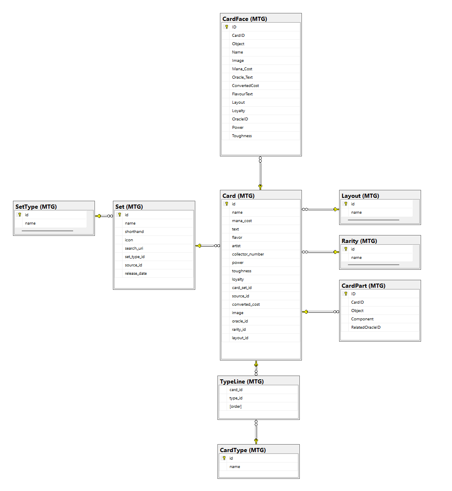

# mtg-loader-py
mtg scryfall loader using pandas

Gets data from [scryfall API](https://scryfall.com/docs/api)

# env settings
## Main
- TCGCT_LOG_LEVEL
    - Set the logging level to be used
    - https://docs.python.org/3/library/logging.html#logging-levels
- TCGCT_BULK_NAME
    - Name of the DB
- TCGCT_CONNECTION_STRING
    - Uses pyodbc, ensure that where you put the DB name you put `##DB_NAME##` 
    - mssql+pyodbc://DESKTOP-XXXXXX\SQLVERSION/##DB_NAME##?driver=ODBC+Driver+17+for+SQL+Server
- TCGCT_BULK_NAME
    - Location and name of the file to store bulk .json files
- TCGCT_LOAD_STRAT="LOCAL"
    - Defines how the raw data is acquired
    - DOWNLOAD
        - Downloads the latest bulk .json from the scryfall API, and then saves it to the `TCGCT_BULK_NAME` location
    - LOCAL
        - Uses existing file in the provided `TCGCT_BULK_NAME` directory
    - SETS
        - Uses the scryfall API to get all Sets, and then loop through all sets and check if our provided DB (`TCGCT_BULK_NAME`) data matches the API

## Testing
TCGCT_TEST_LOG_LEVEL=10
TCGCT_TEST_BULK_NAME="Testing/test_data.json"
TCGCT_TEST_LOAD_STRAT="LOCAL"

# Other stuff

Below image no longer matches DB structure 100%, but is still pretty spot on
